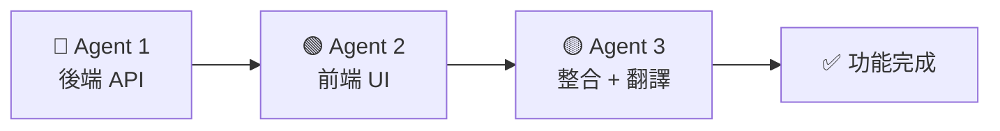

# HeartBox Agent 使用指南

## 🎨 Agent 顏色識別系統

| Agent | 顏色標識 | 專注領域 | 主要技術棧 |
|-------|---------|---------|-----------|
| **🔵 Agent 1** | 藍色 | 後端 API 開發 | Django, DRF, PostgreSQL |
| **🟢 Agent 2** | 綠色 | 前端 UI 開發 | React 19, Tailwind, Vite |
| **🟡 Agent 3** | 黃色 | 整合與本地化 | i18n, Testing, 前後端整合 |

---

## 📋 快速決策指南

### 何時使用 🔵 Agent 1 (Backend Developer)

**適用情況：**
- 需要新增或修改 API 端點
- 資料庫模型設計或遷移
- 業務邏輯實作（services/）
- Django 相關配置與優化
- 資料庫查詢優化

**範例任務：**
```markdown
🔵 請實作「每日提醒」的後端 API：

1. Model 設計（backend/api/models.py）：
   - ReminderSetting 模型
   - 欄位：user, time, frequency, enabled

2. Serializer（backend/api/serializers.py）
3. View（backend/api/views.py）
4. URL 註冊並執行 Django check
```

---

### 何時使用 🟢 Agent 2 (Frontend Developer)

**適用情況：**
- 建立或修改 React 元件
- UI/UX 設計與實作
- Tailwind CSS 樣式調整
- 圖表與數據視覺化
- 前端路由與頁面

**範例任務：**
```markdown
🟢 請建立「習慣追蹤」元件：

1. 檔案位置：frontend/src/components/HabitTracker.jsx

2. UI 設計：
   - 使用 glass 卡片樣式
   - 顯示習慣列表與打卡按鈕
   - Recharts 圖表顯示完成率

3. API 整合：
   - 使用 habitAPI.getList() 獲取資料
   - 處理 loading/error 狀態

4. 多語言：使用 t('habit.*')
```

---

### 何時使用 🟡 Agent 3 (Integration Specialist)

**適用情況：**
- 前後端整合驗證
- 新增或修改多語言翻譯
- 功能測試與問題排查
- 技術文檔撰寫
- 完整功能交付前的最後檢查

**範例任務：**
```markdown
🟡 請為「習慣追蹤」新增多語言翻譯並驗證整合：

1. 翻譯檔案（zh-TW.json, en.json, ja.json）：
   - habit.title, habit.create, habit.checkIn 等

2. 整合驗證：
   - 後端 URL 已註冊
   - 前端 API client 正確
   - 資料格式前後端一致

3. 功能測試：
   - 基本流程測試
   - 三種語言切換測試
```

---

## 🔄 標準開發流程

### 完整功能開發（3 Agent 協作）



**Step 1: 🔵 後端開發**
1. 設計 Model
2. 建立 Migration
3. 撰寫 Serializer
4. 實作 Service 邏輯
5. 建立 View
6. 註冊 URL
7. 執行 Django check

**Step 2: 🟢 前端開發**
1. 建立 API Client
2. 設計 UI 元件
3. 實作資料流
4. 處理 loading/error
5. 整合到路由

**Step 3: 🟡 整合與翻譯**
1. 新增三語翻譯
2. 驗證前後端整合
3. 功能測試
4. 撰寫文檔

---

## 💡 最佳實踐

### 單一 Agent 獨立任務

當任務僅涉及單一領域時，直接使用對應的 Agent：

- **純後端任務** → 🔵 Agent 1
- **純前端任務** → 🟢 Agent 2
- **純翻譯/測試** → 🟡 Agent 3

### 多 Agent 並行開發

對於大型功能，可以同時委派任務給不同 Agent：

```markdown
同時執行：
- 🔵 Agent 1: 實作習慣追蹤後端 API
- 🟢 Agent 2: 設計習慣追蹤 UI 原型
- 🟡 Agent 3: 準備多語言翻譯範本
```

---

## 📁 Agent 文件位置

| Agent | 文件路徑 | 內容 |
|-------|---------|------|
| 🔵 Agent 1 | `docs/AGENT_1_Backend_Developer.md` | Django 開發規範、範本、最佳實踐 |
| 🟢 Agent 2 | `docs/AGENT_2_Frontend_Developer.md` | React 開發規範、設計系統、元件範本 |
| 🟡 Agent 3 | `docs/AGENT_3_Integration_Specialist.md` | 翻譯規範、整合驗證清單、測試流程 |

---

## 🎯 常見任務分工範例

### 任務：新增「睡眠分析」功能

| Agent | 負責內容 | 預估時間 |
|-------|---------|---------|
| 🔵 Agent 1 | `DailySleep` model 增強、分析 service、API 端點 | 4 小時 |
| 🟢 Agent 2 | `SleepAnalysis.jsx` 元件、圖表視覺化 | 3 小時 |
| 🟡 Agent 3 | 翻譯 15 keys、整合測試、撰寫使用文檔 | 2 小時 |

### 任務：修復「日記匯出 PDF 錯誤」

| Agent | 負責內容 |
|-------|---------|
| 🔵 Agent 1 | 檢查 `pdf_export.py` service、修復錯誤 |
| 🟢 Agent 2 | (不需要) |
| 🟡 Agent 3 | 驗證修復、測試多種情境 |

### 任務：UI 樣式優化

| Agent | 負責內容 |
|-------|---------|
| 🔵 Agent 1 | (不需要) |
| 🟢 Agent 2 | 調整 Tailwind 樣式、優化響應式設計 |
| 🟡 Agent 3 | 測試不同語言下的 UI 是否正常 |

---

## 📞 快速參考卡

### 🔵 Agent 1 關鍵字
```
Model, Serializer, View, Service, Migration, 
Django, DRF, PostgreSQL, API, Backend
```

### 🟢 Agent 2 關鍵字
```
Component, JSX, Tailwind, Glass, UI, UX,
React, Hooks, Recharts, Frontend, 頁面
```

### 🟡 Agent 3 關鍵字
```
翻譯, i18n, zh-TW, en, ja, 整合, 測試,
文檔, Localization, Integration
```

---

## ⚡ 效率技巧

1. **明確指定 Agent 顏色**
   - ✅ 「🔵 請實作...」
   - ❌ 「請實作...」（不明確）

2. **提供完整上下文**
   - 包含檔案路徑
   - 說明功能需求
   - 列出相關模型/元件

3. **使用範本格式**
   - 參考各 Agent 文件中的「常見任務範本」
   - 結構化的需求更容易執行

4. **驗證環節不可少**
   - 🔵 後端：`python manage.py check`
   - 🟢 前端：`npm run build`
   - 🟡 整合：功能測試 + 語言切換

---

**建立日期：** 2026-04-19  
**適用版本：** HeartBox v1.0+
