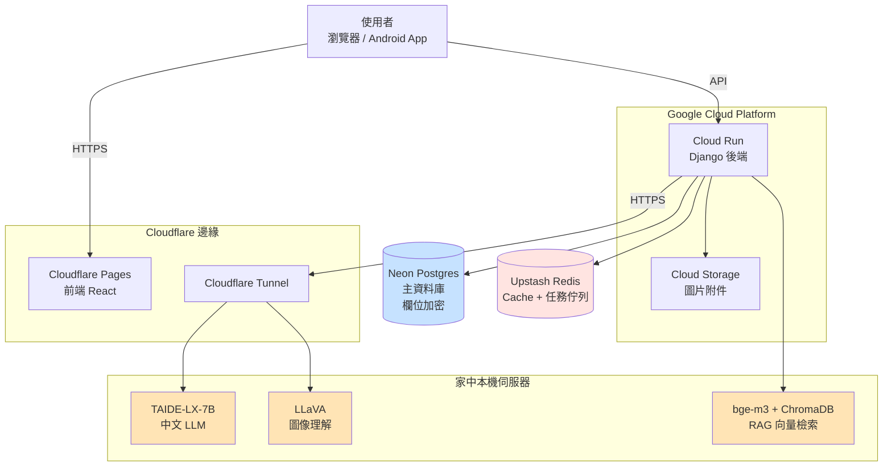
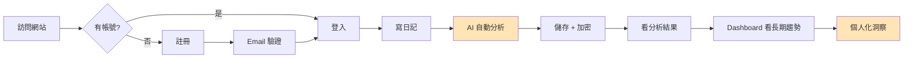
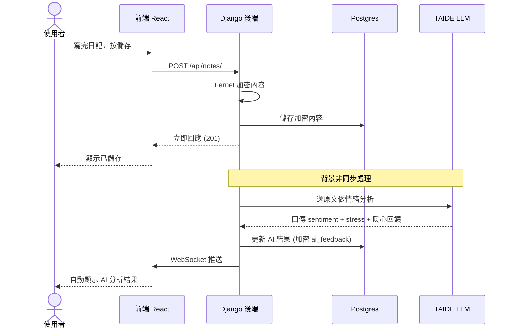
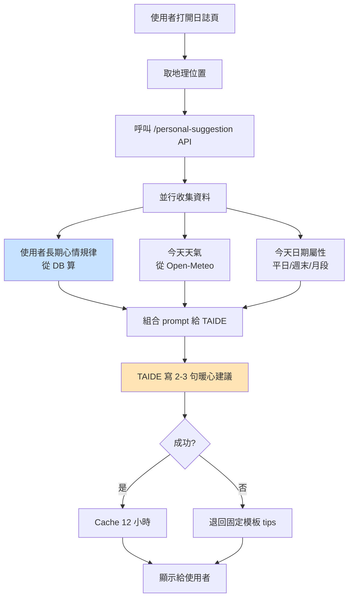
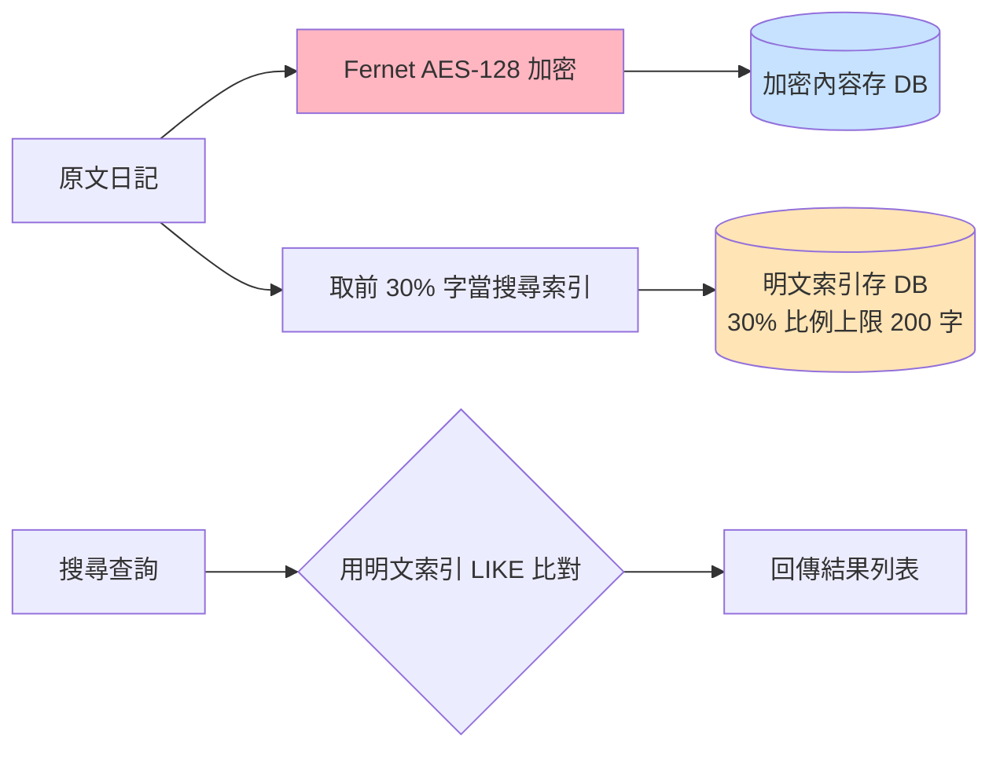
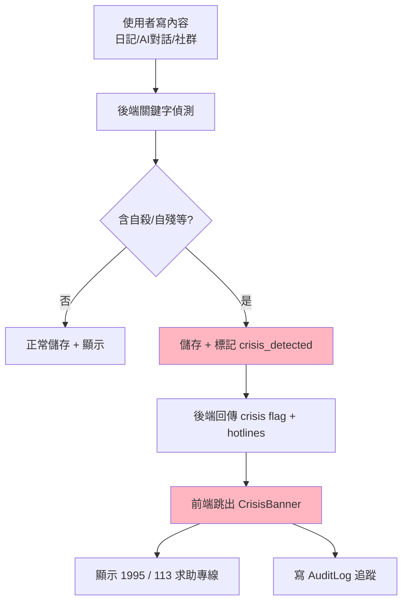

# HeartBox 心事盒 — PPT 流程圖（精簡版）

> 給專題評審 PPT 用的幾張簡單流程圖。可以：
> 1. 直接複製下面 **Mermaid 程式碼** 貼到 [mermaid.live](https://mermaid.live) → 匯出 PNG
> 2. 或用 ASCII 版本截圖
> 3. 或丟給 Claude/ChatGPT 說「幫我把這個 mermaid 轉成 draw.io / Figma」

---

## 圖 1：系統架構總覽（最常用）

### Mermaid



### ASCII 版（如果 PPT 不支援 mermaid）

```
        ┌─────────────────┐
        │ 使用者(Web/Android)│
        └────────┬────────┘
                 │ HTTPS
        ┌────────▼────────────────┐
        │   Cloudflare 邊緣節點     │
        │   - Pages (前端 CDN)      │
        │   - Tunnel (LLM 通道)     │
        └────────┬────────────────┘
                 │
        ┌────────▼────────┐      ┌──────────────┐
        │  Cloud Run      │─────▶│ Neon Postgres│
        │  Django 後端    │      │ (加密儲存)    │
        └─┬──────────┬────┘      └──────────────┘
          │          │
          │          ▼
          │     ┌─────────────┐
          │     │ GCS (圖片)  │
          │     └─────────────┘
          │
          ▼
        ┌─────────────────────────┐
        │  本機 LLM 伺服器          │
        │  - TAIDE-LX-7B (中文)    │
        │  - LLaVA (圖像)          │
        │  - bge-m3 (向量檢索)     │
        └─────────────────────────┘
```

---

## 圖 2：使用者主要流程

### Mermaid



### ASCII 版

```
[訪問網站]
    ↓
  <有帳號?>
    │
    ├─否─→ [註冊] → [Email 驗證]
    │                    │
    │                    ↓
    ├─是─→ [登入] ←──────┘
              ↓
        [寫日記]
              ↓
        [AI 自動分析]  ← TAIDE 推理 5-15 秒
              ↓
        [儲存 + 加密]  ← Fernet AES-128
              ↓
        [看分析結果]
              ↓
        [Dashboard 看長期趨勢]
              ↓
        [個人化洞察 5 維度]
```

---

## 圖 3：AI 日記分析流程（重點）

### Mermaid



### ASCII 版

```
[使用者]            [前端]           [後端]          [DB]         [TAIDE]
   │                  │                │              │              │
   │─按儲存─────────▶│                │              │              │
   │                  │─POST /notes/─▶│              │              │
   │                  │                │─加密 + 存─▶│              │
   │                  │◀──回應 201────│              │              │
   │◀─顯示已儲存─────│                │              │              │
   │                  │                │              │              │
   │                  │                │═背景═══════════════════════│
   │                  │                │─送原文分析─────────────────▶│
   │                  │                │◀─sentiment + stress + 回饋─│
   │                  │                │─更新 + 加密─▶│              │
   │                  │◀── WebSocket 推送 ──────────│              │
   │◀─自動顯示 AI 結果│                │              │              │
```

---

## 圖 4：個人化建議流程（HeartBox 最特色）

### Mermaid



### ASCII 版

```
[使用者打開日誌頁]
        ↓
   [取地理位置]
        ↓
   [呼叫 personal-suggestion API]
        ↓
   ┌────並行收集────┐
   ↓        ↓        ↓
[長期心情] [今天天氣] [日期屬性]
   ↓        ↓        ↓
   └────組合 prompt────┘
        ↓
   [TAIDE 生成 2-3 句暖心話]
        ↓
   <成功?>
    │
    ├─是→ [Cache 12 小時] → [顯示]
    │
    └─否→ [退回固定模板 tips] → [顯示]
```

---

## 圖 5：資料安全（加密）流程

### Mermaid



### ASCII 版

```
   [原文日記]
       │
       ├──→ [AES-128 加密] ──→ ┌──────────────┐
       │                       │ encrypted_   │
       │                       │ content      │  (DB 看到的是亂碼)
       │                       └──────────────┘
       │
       └──→ [取前 30% 字] ────→ ┌──────────────┐
                                │ search_text  │  (明文，給搜尋用)
                                │ 比例 30%     │
                                │ 上限 200 字  │
                                └──────────────┘
                                       ▲
                                       │
                                  [搜尋查詢]
                                       │ LIKE 比對
                                       ▼
                                  [結果列表]
```

---

## 圖 6：危機關鍵字處理

### Mermaid



### ASCII 版

```
[使用者寫內容]
        ↓
[後端關鍵字偵測 + LLM 雙保險]
        ↓
   <含危機字眼?>
    │
    ├─否→ [正常儲存]
    │
    └─是→ [儲存 + 標記 crisis_detected]
            ↓
          [回傳危機 flag + 求助資源]
            ↓
          [前端跳 CrisisBanner]
            ↓
        ┌──────────────┐
        │ 你並不孤單    │
        │ 1995 生命線   │
        │ 113 婦幼專線  │
        └──────────────┘
            ↓
          [寫 AuditLog 追蹤]
```

---

## 圖 7：技術棧一覽（給 slides 上「技術選用」那頁）

```
┌─────────────────────────────────────────────────────────┐
│                       前端                              │
│  React 18 + Vite + Tailwind 4 + Tiptap + Recharts      │
│  Capacitor (Android App) + PWA Service Worker          │
└─────────────────────────────────────────────────────────┘
                        ↓
┌─────────────────────────────────────────────────────────┐
│                       後端                              │
│  Django 5 + DRF + Celery + JWT                         │
│  Postgres (Neon) + Redis (Upstash) + GCS               │
└─────────────────────────────────────────────────────────┘
                        ↓
┌─────────────────────────────────────────────────────────┐
│                       AI                                │
│  TAIDE-LX-7B (繁中對話) + LLaVA (圖像)                  │
│  bge-m3 + ChromaDB (RAG 心理知識檢索)                   │
└─────────────────────────────────────────────────────────┘
                        ↓
┌─────────────────────────────────────────────────────────┐
│                      部署 / 運維                         │
│  Cloud Run + Cloudflare Pages + Tunnel                 │
│  GitHub Actions CI/CD + NSSM (Windows Service)         │
│  Sentry 錯誤追蹤                                        │
└─────────────────────────────────────────────────────────┘
```

---

## 怎麼把 Mermaid 變成 PPT 圖片

**方法 1（最快）**：
1. 開 https://mermaid.live
2. 把上面 `mermaid` 區塊的程式碼貼進去（不含 \`\`\`mermaid 開頭和結尾）
3. 右上角「Actions」→「PNG」下載
4. 拖到 PowerPoint / Google Slides

**方法 2（更精緻）**：
1. 同上得到 PNG
2. 用 [draw.io](https://app.diagrams.net) 重新畫一遍（PNG 當底）
3. 匯出 PNG / SVG 給 PPT

**方法 3（最快但醜）**：
1. 直接用 ASCII 版
2. 在 PowerPoint 用「等寬字型」（如 Consolas / Courier New）
3. 縮排對齊 → 截圖

---

## 給評審的「一張圖」推薦

如果只能放 **一張** 在 PPT，我推薦 **圖 1 系統架構** — 它包含整個專題的所有重點：

- 跨雲（Cloudflare + GCP）+ 本機（你家電腦跑 LLM）的混合架構
- 加密儲存（Neon）
- 三個 AI 模型（TAIDE / LLaVA / bge-m3）
- 資料路徑清楚

評審看一眼就知道你做了多少事。

如果可以放 **三張**，我推薦：
1. 圖 1 架構總覽 — 開場用
2. 圖 3 AI 分析流程 — 講 AI 那部分用
3. 圖 4 個人化建議 — 講 HeartBox 的特色用

---

## 結語

這份是給「PPT 用」的精簡版，不要陷入細節。

實際 demo + Q&A 還是會碰到細節，但那些都在 `docs/技術說明.md`（800 行）和 `docs/功能流程.md`（1591 行）裡，需要時再翻。

PPT 簡單清楚就好。
