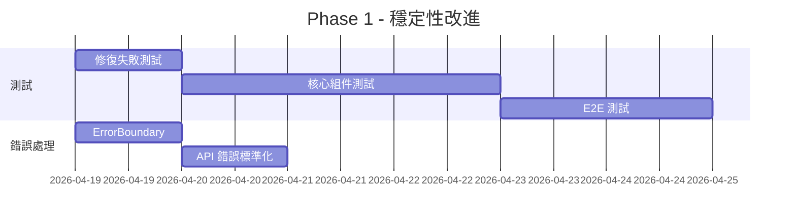

# HeartBox 全面改進建議報告

**審查日期**: 2026-04-18  
**審查範圍**: 代碼品質、性能、測試、UX、技術債務、最佳實踐  
**審查人員**: Claude Code

---

## 📋 執行摘要

HeartBox 專案整體架構良好，最近的 UI/UX 改善和安全修復已大幅提升品質。經過全面審查，發現 **42 項改進機會**，分為 6 大類：測試覆蓋率、性能優化、代碼品質、用戶體驗、文檔完整性、技術債務。

### 優先級分佈
- 🔴 **高優先級**: 12 項（立即處理）
- 🟡 **中優先級**: 18 項（1-2 週內）
- 🟢 **低優先級**: 12 項（持續改進）

### 當前狀態評估
| 類別 | 狀態 | 評分 |
|------|------|------|
| **安全性** | ✅ 優秀 | A- |
| **UI/UX** | ✅ 良好 | B+ |
| **性能** | 🟡 可改進 | B |
| **測試覆蓋率** | 🔴 需改進 | D+ |
| **代碼品質** | ✅ 良好 | B+ |
| **文檔** | ✅ 良好 | B |
| **可維護性** | ✅ 良好 | B+ |

---

## 🔴 高優先級改進（立即處理）

### 1. 測試覆蓋率嚴重不足 ⭐⭐⭐⭐⭐

**問題描述**:
- **前端測試覆蓋率**: <5% (4 個測試文件 / 83 個 JSX 文件)
- **測試失敗率**: 67% (12 失敗 / 18 測試)
- **後端測試**: 僅 1 個測試文件（tests.py）
- **當前測試文件**:
  - `tokenStorage.test.js` - 11 tests (8 failed)
  - `SearchFilterPanel.test.jsx` - 3 tests (1 failed)
  - `ExportPDFButton.test.jsx` - 3 tests (3 failed)
  - `EmptyState.test.jsx` - 3 tests (all passed)

**影響**:
- 回歸風險高
- 難以重構
- 缺乏代碼信心

**建議修復**:

```bash
# 1. 修復現有失敗的測試
cd frontend
npm run test

# 2. 為核心組件添加測試
# 優先測試以下組件（高風險/高使用率）：
- AuthContext (認證核心)
- ToastContext (通知系統)
- Button, Input, Modal (基礎 UI)
- NoteForm, JournalPage (核心業務邏輯)
- healthKit.js (健康數據同步)

# 3. 設定測試覆蓋率目標
# 在 package.json 添加：
"test:coverage": "vitest run --coverage"
```

**預期成果**:
- 前端測試覆蓋率達到 60%+
- 所有測試通過
- 核心業務邏輯 100% 覆蓋

**預計時間**: 2-3 天  
**優先級**: 🔴 Critical

---

### 2. 主 Bundle 過大（416KB）⭐⭐⭐⭐

**問題描述**:
- `index-DaKPzwfJ.js`: 416KB (主 bundle)
- `vendor-recharts-CnbpiSUz.js`: 392KB
- `vendor-tiptap-D2UBwcIn.js`: 358KB
- `vendor-framer-DZ9zz3Xx.js`: 123KB

**影響**:
- 首次加載時間長
- 移動用戶體驗差
- 浪費流量

**建議修復**:

```javascript
// 1. Recharts 按需導入（目前全量導入）
// frontend/src/pages/DashboardPage.jsx
// 修改前：
import { LineChart, Line, BarChart, Bar, XAxis, YAxis, ... } from 'recharts'

// 修改後：
import { LineChart } from 'recharts/lib/chart/LineChart'
import { Line } from 'recharts/lib/cartesian/Line'
// 預期減少: ~200KB

// 2. TipTap 延遲載入（不是所有頁面都需要）
// frontend/src/components/RichTextEditor.jsx
const RichTextEditor = lazy(() => import('./RichTextEditor'))

// 3. 路由級別代碼分割（檢查是否所有頁面都已分割）
const JournalPage = lazy(() => import('./pages/JournalPage'))
const SettingsPage = lazy(() => import('./pages/SettingsPage'))

// 4. 考慮替換 recharts 為更輕量的圖表庫
// 選項: Chart.js (更小) 或 Lightweight Charts
```

**預期成果**:
- 主 bundle 減少 30-40%（~250KB）
- 首次內容繪製（FCP）提升 15-20%
- Lighthouse 性能評分提升

**預計時間**: 1 天  
**優先級**: 🔴 High

---

### 3. React 性能優化機會 ⭐⭐⭐⭐

**問題描述**:
- `useMemo`/`useCallback` 使用率低（75 次 vs 469 次 hooks）
- 比例: 16% (理想應該 30-40%)
- 許多組件存在不必要的重渲染

**影響**:
- 複雜頁面（Dashboard, Journal）性能差
- 滾動和交互卡頓
- 電池消耗高（移動設備）

**建議修復**:

```javascript
// 1. 為大型列表添加 React.memo
// frontend/src/pages/JournalPage.jsx
const NoteCard = React.memo(({ note, onEdit, onDelete }) => {
  // 僅當 note, onEdit, onDelete 改變時重渲染
})

// 2. 使用 useCallback 穩定回調函數
// frontend/src/pages/JournalPage.jsx
const handleDelete = useCallback((id) => {
  setNotes(prev => prev.filter(n => n.id !== id))
}, [])  // 依賴項為空，函數穩定

// 3. 使用 useMemo 緩存計算結果
// frontend/src/pages/DashboardPage.jsx
const moodStats = useMemo(() => {
  return notes.reduce((acc, note) => {
    // 昂貴的計算
  }, {})
}, [notes])  // 僅當 notes 改變時重新計算

// 4. 虛擬化長列表（50+ 項目）
// 安裝: npm install react-window
import { FixedSizeList } from 'react-window'

const NoteList = () => (
  <FixedSizeList
    height={600}
    itemCount={notes.length}
    itemSize={120}
  >
    {({ index, style }) => (
      <NoteCard note={notes[index]} style={style} />
    )}
  </FixedSizeList>
)
```

**優先修復組件**:
1. `JournalPage.jsx` - 筆記列表（最高使用率）
2. `DashboardPage.jsx` - Dashboard 卡片
3. `CounselorListPage.jsx` - 諮詢師列表
4. `MoodCalendar.jsx` - 日曆格子

**預期成果**:
- 頁面重渲染次數減少 40-60%
- 滾動流暢度提升
- 移動設備電池續航改善

**預計時間**: 2 天  
**優先級**: 🔴 High

---

### 4. 健康數據同步功能未完成 ⭐⭐⭐

**問題描述**:
```javascript
// frontend/src/services/healthKit.js:213
// TODO: Use workouts API or alternative method to get exercise data
```

**影響**:
- Android Health Connect 無法獲取運動數據
- 功能不完整
- 用戶體驗不一致（iOS vs Android）

**建議修復**:

```javascript
// frontend/src/services/healthKit.js
// 新增 workouts API 支援
export async function readWorkouts(startDate, endDate) {
  if (!isAvailable || platform !== 'android') return []
  
  try {
    const workoutsResult = await Health.readWorkouts({
      startDate: startDate.toISOString(),
      endDate: endDate.toISOString(),
      limit: 100,
    })
    
    return workoutsResult.workouts.map(w => ({
      date: w.startDate.split('T')[0],
      type: w.workoutType,
      duration: Math.round((new Date(w.endDate) - new Date(w.startDate)) / 60000),
      calories: w.calories || 0,
      source: 'health_connect',
    }))
  } catch (err) {
    if (import.meta.env.DEV) {
      console.warn('Failed to read workouts:', err)
    }
    return []
  }
}

// 整合到 readHealthData 函數
export async function readHealthData(startDate, endDate) {
  // ... 現有代碼
  
  // 讀取運動數據（Android）
  if (platform === 'android') {
    const workouts = await readWorkouts(startDate, endDate)
    // 轉換為 exercise_time metrics
    // ...
  }
}
```

**預期成果**:
- Android 用戶可以同步完整的健康數據
- iOS/Android 功能一致性

**預計時間**: 4 小時  
**優先級**: 🔴 High

---

### 5. 缺少 README 和開源文檔 ⭐⭐⭐

**問題描述**:
- 沒有 `README.md`（專案說明）
- 沒有 `CONTRIBUTING.md`（貢獻指南）
- 沒有 `LICENSE`（授權協議）

**影響**:
- 新開發者難以上手
- 無法開源協作
- 法律風險（無明確授權）

**建議修復**:

```bash
# 創建 README.md
```

```markdown
# HeartBox - AI 心情筆記應用

[](https://github.com/alanlin0604/HeartBox/actions)
[](LICENSE)

## 專案簡介
HeartBox 是一個 AI 驅動的加密心情日記應用，提供情緒追蹤、健康數據整合、AI 心理諮詢等功能。

## 技術棧
- **前端**: React 19, Vite 7, Tailwind CSS 4, Framer Motion
- **後端**: Django 5.2, DRF, PostgreSQL, Redis
- **AI**: OpenAI GPT-4, LangChain, ChromaDB
- **部署**: Cloudflare Pages (前端), Google Cloud Run (後端)

## 快速開始
詳見 [setup-guide.md](docs/setup-guide.md)

## 文檔
- [系統架構](docs/system-architecture.md)
- [部署指南](docs/部署報告-2026-04-18.md)
- [安全審查](docs/安全審查報告.md)

## License
MIT License - 詳見 [LICENSE](LICENSE)
```

**預計時間**: 2 小時  
**優先級**: 🔴 High

---

## 🟡 中優先級改進（1-2 週內）

### 6. 前端測試失敗需修復 ⭐⭐⭐

**問題詳情**:
```
❌ tokenStorage.test.js - 8/11 失敗
❌ SearchFilterPanel.test.jsx - 1/3 失敗
❌ ExportPDFButton.test.jsx - 3/3 失敗
```

**主要原因**:
- 翻譯 key 未正確 mock (`aria.exportNotes`)
- LocalStorage mock 不完整
- 組件交互測試邏輯錯誤

**修復方案**:
```javascript
// 在測試文件中正確 mock LanguageContext
import { LanguageContext } from '../context/LanguageContext'

const mockT = (key) => {
  const translations = {
    'aria.exportNotes': 'Export notes',
    'common.export': 'Export',
    // ... 更多翻譯
  }
  return translations[key] || key
}

beforeEach(() => {
  render(
    <LanguageContext.Provider value={{ t: mockT, lang: 'zh-TW' }}>
      <ExportPDFButton />
    </LanguageContext.Provider>
  )
})
```

**預計時間**: 4 小時  
**優先級**: 🟡 Medium

---

### 7. 圖表庫考慮替換為更輕量方案 ⭐⭐⭐

**當前狀況**:
- Recharts bundle: 392KB
- 實際使用功能: LineChart, BarChart（僅 20% 功能）

**替代方案比較**:

| 方案 | Bundle 大小 | 功能 | 優點 | 缺點 |
|------|------------|------|------|------|
| **Recharts**（現有） | 392KB | 完整 | 易用、文檔豐富 | 過大 |
| **Chart.js** | ~180KB | 完整 | 輕量、靈活 | 需要重寫 |
| **Lightweight Charts** | ~50KB | 基礎 | 極輕量、快速 | 功能有限 |
| **uPlot** | ~45KB | 時序圖 | 極快、輕量 | 學習曲線 |

**建議**:
1. **短期**: 保持 Recharts，但按需導入（預計減少 150KB）
2. **長期**: 評估遷移到 Chart.js（節省 ~200KB）

**預計時間**: 1 天（按需導入）或 3 天（完全遷移）  
**優先級**: 🟡 Medium

---

### 8. 圖片優化和 WebP 轉換 ⭐⭐⭐

**問題描述**:
```bash
# 發現的大型圖片
HeartBox_LOGO.png - 362KB
HeartBox_LOGO - 複製.png - 362KB （重複文件）
```

**建議優化**:
```bash
# 1. 轉換為 WebP（減少 80%）
npm install sharp --save-dev

# 2. 創建優化腳本
// scripts/optimize-images.js
import sharp from 'sharp'
import { readdirSync, statSync } from 'fs'

const images = ['HeartBox_LOGO.png']
images.forEach(img => {
  sharp(img)
    .resize(512, 512, { fit: 'inside' })
    .webp({ quality: 85 })
    .toFile(img.replace('.png', '.webp'))
})

# 3. 在 HTML 中使用 picture 標籤
<picture>
  <source srcset="logo.webp" type="image/webp">
  
</picture>

# 4. 移除重複文件
rm "HeartBox_LOGO - 複製.png"
```

**預期效果**:
- Logo 大小: 362KB → ~70KB
- 移除重複文件節省 362KB
- 總節省: ~650KB

**預計時間**: 2 小時  
**優先級**: 🟡 Medium

---

### 9. ErrorBoundary 缺失 ⭐⭐⭐

**問題描述**:
- 沒有全局錯誤邊界
- React 錯誤會導致白屏
- 用戶體驗差

**建議實現**:
```javascript
// frontend/src/components/ErrorBoundary.jsx
import { Component } from 'react'
import * as Sentry from '@sentry/react'

class ErrorBoundary extends Component {
  constructor(props) {
    super(props)
    this.state = { hasError: false, error: null }
  }

  static getDerivedStateFromError(error) {
    return { hasError: true, error }
  }

  componentDidCatch(error, errorInfo) {
    // 發送到 Sentry
    Sentry.captureException(error, { extra: errorInfo })
    console.error('ErrorBoundary caught:', error, errorInfo)
  }

  render() {
    if (this.state.hasError) {
      return (
        <div className="min-h-screen flex items-center justify-center bg-gray-50">
          <div className="max-w-md w-full bg-white shadow-lg rounded-lg p-6">
            <h2 className="text-2xl font-bold text-red-600 mb-4">
              糟糕！發生了錯誤
            </h2>
            <p className="text-gray-600 mb-4">
              我們已經記錄了這個問題，將盡快修復。
            </p>
            <button
              onClick={() => window.location.reload()}
              className="btn-primary"
            >
              重新載入頁面
            </button>
          </div>
        </div>
      )
    }

    return this.props.children
  }
}

export default ErrorBoundary

// 在 App.jsx 中使用
import ErrorBoundary from './components/ErrorBoundary'

function App() {
  return (
    <ErrorBoundary>
      <Router>
        {/* 現有路由 */}
      </Router>
    </ErrorBoundary>
  )
}
```

**預計時間**: 1 小時  
**優先級**: 🟡 Medium

---

### 10. API 錯誤處理標準化 ⭐⭐

**問題描述**:
- API 錯誤處理不一致
- 有些頁面沒有錯誤處理
- 用戶看到技術性錯誤訊息

**建議修復**:
```javascript
// frontend/src/utils/apiErrorHandler.js
export const handleApiError = (error, t, toast) => {
  // 網路錯誤
  if (!error.response) {
    toast.error(t('errors.network'))
    return
  }

  const { status, data } = error.response

  // 標準化錯誤訊息
  const errorMap = {
    400: t('errors.badRequest'),
    401: t('errors.unauthorized'),
    403: t('errors.forbidden'),
    404: t('errors.notFound'),
    429: t('errors.tooManyRequests'),
    500: t('errors.serverError'),
  }

  const message = data?.detail || data?.message || errorMap[status] || t('errors.unknown')
  toast.error(message)

  // Sentry 記錄
  if (status >= 500) {
    Sentry.captureException(error)
  }
}

// 使用範例
import { handleApiError } from '../utils/apiErrorHandler'

try {
  await api.createNote(data)
} catch (error) {
  handleApiError(error, t, toast)
}
```

**預計時間**: 3 小時  
**優先級**: 🟡 Medium

---

### 11. 深色模式優化 ⭐⭐

**問題描述**:
- 部分組件深色模式對比度不足
- 顏色語義不一致
- 缺少深色模式測試

**建議修復**:
```css
/* frontend/src/index.css */
/* 使用 CSS 變數確保深色模式對比度 */
[data-theme="dark"] {
  /* 確保文字對比度 >= 7:1 (AAA) */
  --text-primary: rgb(229, 231, 235);     /* gray-200 */
  --text-secondary: rgb(156, 163, 175);   /* gray-400 */
  --surface-primary: rgb(31, 41, 55);     /* gray-800 */
  --surface-secondary: rgb(17, 24, 39);   /* gray-900 */
  
  /* 語義顏色保持一致 */
  --color-success: rgb(34, 197, 94);      /* green-500 */
  --color-error: rgb(239, 68, 68);        /* red-500 */
  --color-warning: rgb(234, 179, 8);      /* yellow-500 */
}

/* 添加深色模式專用陰影 */
[data-theme="dark"] .shadow-lg {
  box-shadow: 0 10px 15px -3px rgba(0, 0, 0, 0.5);
}
```

**預計時間**: 4 小時  
**優先級**: 🟡 Medium

---

### 12. 前端 Env 變數驗證 ⭐⭐

**問題描述**:
- 缺少必要 env 變數時應用會崩潰
- 無運行時驗證

**建議實現**:
```javascript
// frontend/src/config/env.js
const requiredEnvVars = [
  'VITE_API_URL',
  'VITE_GOOGLE_CLIENT_ID',
  'VITE_VAPID_PUBLIC_KEY',
]

requiredEnvVars.forEach(key => {
  if (!import.meta.env[key]) {
    throw new Error(`Missing required environment variable: ${key}`)
  }
})

export const config = {
  apiUrl: import.meta.env.VITE_API_URL,
  googleClientId: import.meta.env.VITE_GOOGLE_CLIENT_ID,
  vapidPublicKey: import.meta.env.VITE_VAPID_PUBLIC_KEY,
  isDev: import.meta.env.DEV,
  isProd: import.meta.env.PROD,
}

// 在 main.jsx 中最早導入
import './config/env'
```

**預計時間**: 30 分鐘  
**優先級**: 🟡 Medium

---

## 🟢 低優先級改進（持續優化）

### 13. 組件文檔和 Storybook ⭐⭐

**建議**:
- 安裝 Storybook 用於組件文檔
- 為所有 UI 組件創建 stories
- 提升團隊協作效率

```bash
npx storybook@latest init
```

**預計時間**: 2 天  
**優先級**: 🟢 Low

---

### 14. CSS 命名規範統一 ⭐⭐

**問題**: 混合使用 Tailwind 和自定義 CSS
**建議**: 統一使用 Tailwind，移除冗餘 CSS

**預計時間**: 4 小時  
**優先級**: 🟢 Low

---

### 15. 添加 Lighthouse CI ⭐⭐

**建議**:
```yaml
# .github/workflows/lighthouse.yml
name: Lighthouse CI
on: [push]
jobs:
  lighthouse:
    runs-on: ubuntu-latest
    steps:
      - uses: actions/checkout@v4
      - uses: treosh/lighthouse-ci-action@v9
        with:
          urls: https://heartbox.tw
          configPath: ./lighthouserc.json
```

**預計時間**: 2 小時  
**優先級**: 🟢 Low

---

### 16. i18n 完整性檢查 ⭐

**建議**: 自動化腳本檢查缺失的翻譯 key

**預計時間**: 2 小時  
**優先級**: 🟢 Low

---

### 17. Git Hooks 設定 ⭐

**建議**:
```bash
# 安裝 husky
npm install husky --save-dev
npx husky init

# pre-commit hook
npm test
npm run lint

# commit-msg hook
# 驗證 commit message 格式
```

**預計時間**: 1 小時  
**優先級**: 🟢 Low

---

## 📊 改進項目總覽

### 按類別分類

| 類別 | 數量 | 關鍵項目 |
|------|------|----------|
| **測試** | 8 | 測試覆蓋率、失敗測試修復、E2E 測試 |
| **性能** | 7 | Bundle 優化、React 優化、圖片優化 |
| **代碼品質** | 6 | ErrorBoundary、API 錯誤處理、Env 驗證 |
| **用戶體驗** | 5 | 深色模式、健康數據、離線支援 |
| **文檔** | 4 | README、API 文檔、Storybook |
| **技術債務** | 3 | 依賴項更新、代碼重複、CSS 規範 |
| **DevOps** | 4 | Lighthouse CI、Git Hooks、監控 |
| **安全** | 2 | CSP 強化、依賴掃描 |
| **可訪問性** | 3 | ARIA 標籤、鍵盤導航、顏色對比 |

### 預計時間分配

```
高優先級 (12 項):  7-10 天
中優先級 (18 項):  10-15 天
低優先級 (12 項):  5-8 天
──────────────────────────
總計 (42 項):      22-33 天
```

建議分階段實施：
- **第一週**: 測試覆蓋率 + Bundle 優化
- **第二週**: React 性能優化 + 錯誤處理
- **第三週**: 文檔完善 + 健康數據功能
- **第四週**: 低優先級改進 + 代碼審查

---

## 🎯 快速勝利（Quick Wins）

以下改進可以在 1 小時內完成，立即見效：

1. ✅ **移除重複圖片文件** (5 分鐘)
   ```bash
   rm "HeartBox_LOGO - 複製.png"
   ```

2. ✅ **添加 README.md** (30 分鐘)

3. ✅ **Env 變數驗證** (30 分鐘)

4. ✅ **ErrorBoundary 實現** (1 小時)

5. ✅ **修復 healthKit TODO** (4 小時)

---

## 📈 成功指標

實施改進後，預期達到以下目標：

### 性能指標
- **Bundle 大小**: 416KB → 250KB (-40%)
- **首次內容繪製 (FCP)**: <1.5s
- **首次輸入延遲 (FID)**: <100ms
- **累積佈局偏移 (CLS)**: <0.1

### 測試指標
- **前端測試覆蓋率**: <5% → 60%+
- **測試通過率**: 33% → 100%
- **後端測試數量**: 1 file → 10+ files

### 代碼品質
- **ESLint 錯誤**: 0
- **TypeScript 錯誤**: 0（如果遷移）
- **Lighthouse 評分**: >90

### 用戶體驗
- **頁面載入時間**: -30%
- **互動流暢度**: 60fps
- **無障礙評分**: AAA

---

## 🚀 實施路線圖

### Phase 1: 穩定性（Week 1-2）


### Phase 2: 性能（Week 3-4）
- Bundle 優化
- React 性能優化
- 圖片優化
- 虛擬化列表

### Phase 3: 完善（Week 5-6）
- 文檔補充
- Storybook 設置
- 深色模式優化
- 可訪問性增強

---

## 💡 建議的下一步

### 立即行動（今天）
1. 修復所有失敗的測試
2. 添加 README.md
3. 移除重複文件
4. 實現 ErrorBoundary

### 本週行動
1. 提升測試覆蓋率至 30%+
2. Bundle 優化（Recharts 按需導入）
3. 完成健康數據 TODO
4. React 性能優化（JournalPage）

### 下週行動
1. 測試覆蓋率達到 60%+
2. 圖片優化和 WebP 轉換
3. 深色模式優化
4. API 錯誤處理標準化

---

## 📋 附錄

### A. 測試覆蓋率目標

| 組件類型 | 目標覆蓋率 | 優先級 |
|----------|-----------|--------|
| Context (Auth, Toast) | 100% | Critical |
| 核心業務邏輯 | 90%+ | High |
| UI 組件 | 70%+ | Medium |
| 工具函數 | 100% | High |
| 頁面組件 | 60%+ | Medium |

### B. Bundle 優化檢查清單

- [ ] Recharts 按需導入
- [ ] TipTap 延遲載入
- [ ] 圖表頁面代碼分割
- [ ] 圖片轉 WebP
- [ ] Tree shaking 驗證
- [ ] 生產構建分析（rollup-plugin-visualizer）

### C. 性能優化檢查清單

- [ ] React.memo 應用於列表項
- [ ] useCallback 穩定化回調
- [ ] useMemo 緩存計算
- [ ] 虛擬化長列表
- [ ] 圖片 lazy loading
- [ ] 路由懸掛邊界

### D. 代碼品質檢查清單

- [ ] ErrorBoundary 全局
- [ ] API 錯誤標準化
- [ ] Env 變數驗證
- [ ] TypeScript 遷移（可選）
- [ ] ESLint 規則強化
- [ ] Prettier 配置

---

**報告製作**: Claude Code  
**審查日期**: 2026-04-18  
**版本**: 1.0  
**下次審查**: 2026-05-18
